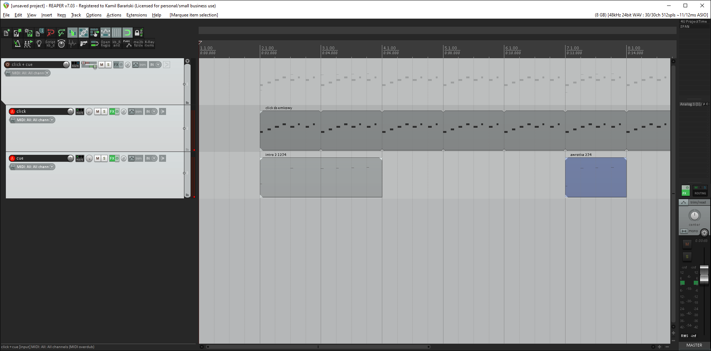

**Click** and **cue** instruments for playing with backing tracks.

tested with Kontakt 6.8 and Reaper 7.03.

Cues in Polish language.

Todo:
* other languages,
* speed/tune automation (with host automation),
* correct values on knobs.

There's also <a href="https://github.com/kamilbaranskicom/kb_ReaScripts/blob/master/kb_Rename%20and%20color%20selected%20items%20depending%20on%20MIDI%20notes.lua">the script for renaming items according to cues</a>.

Any suggestions?
